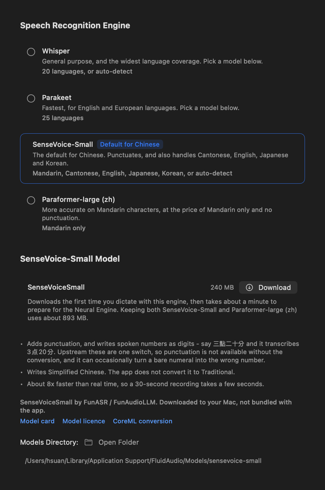
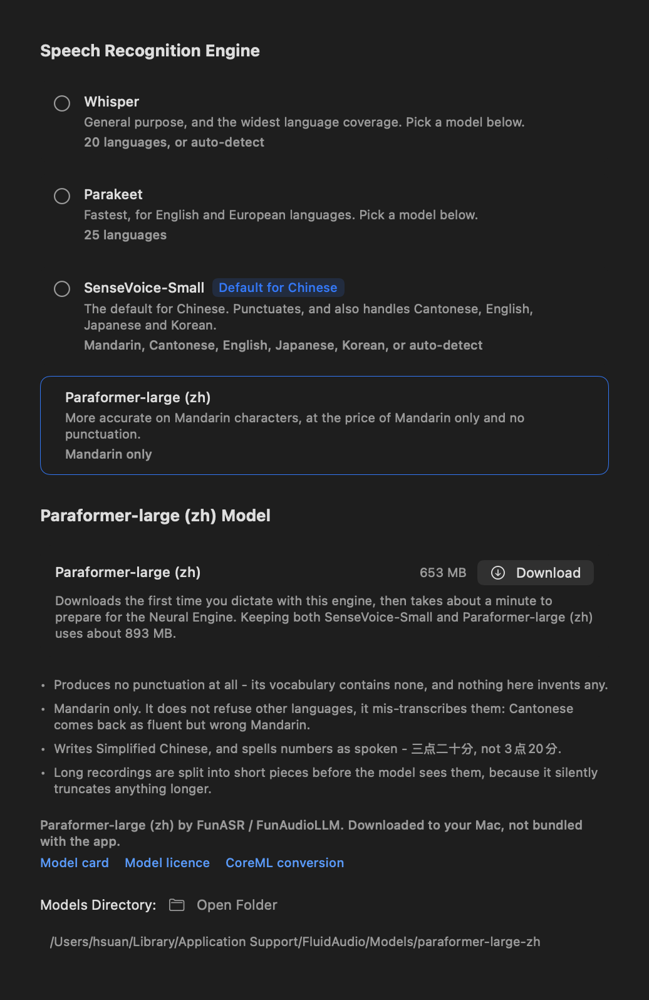
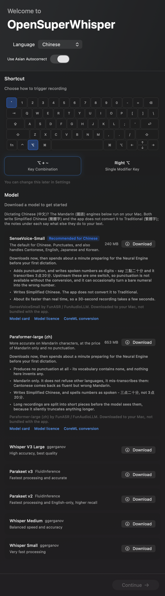
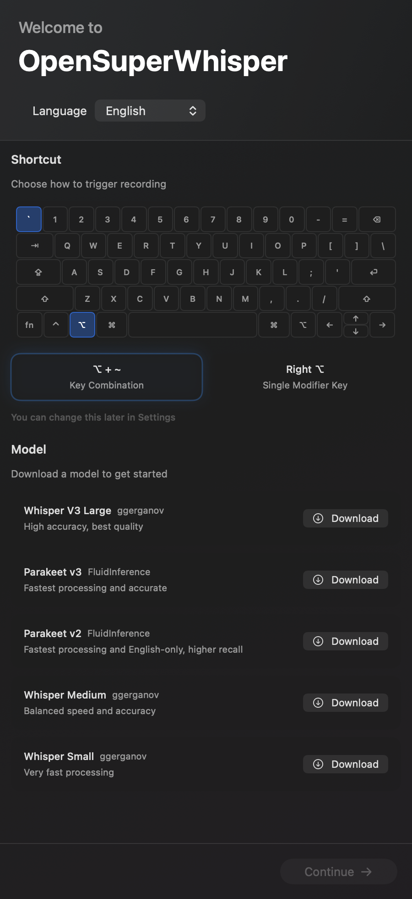

# Speech model attribution

This is the app's attribution surface for speech models it downloads but does not own.
An entry lands here in the same change as the engine that uses it, and must name the model,
its author, and the licence its weights are distributed under.

Every model except one is fetched from Hugging Face at runtime, on the user's machine, at the
user's request. Keep it that way for anything new: the CoreML conversions the app fetches assert
no licence of their own and defer to their upstream, so redistributing them - inside a build or
as a release asset - is a claim that has to be justified per model rather than taken as the
default.

**The one exception is SenseVoiceSmall.** A build may be packaged with it as the starter model,
so a fresh install can dictate without a first-run download ([starter-model.md](starter-model.md)),
and its weights may be published as a model pack release asset ([model-packs.md](model-packs.md)).
Both are redistribution, and the obligations either carries are set out under SenseVoice-Small
below. It is deliberately limited to that one model: Paraformer is still download-only, and no
other model may be bundled or published as a pack without the same paragraph being written for it
first. Builds are produced both with and without the starter from the same source, so the app
states which it is (`EngineCatalog.provenanceLine`, pinned by `StarterModelProvenanceTests`)
rather than carrying one fixed sentence that would be wrong half the time.

## SenseVoice-Small

**SenseVoiceSmall by FunASR/FunAudioLLM.** Multilingual speech recognition with punctuation,
used by the SenseVoice engine (`OpenSuperWhisper/Engines/SenseVoiceEngine.swift`) - the default
Chinese dictation engine.

| | |
|---|---|
| Model | SenseVoiceSmall (Mandarin, Cantonese, English, Japanese, Korean) |
| Author | FunASR / FunAudioLLM (Alibaba Group) |
| Upstream model card | <https://huggingface.co/FunAudioLLM/SenseVoiceSmall> - `license: other`, `license_name: model-license` |
| ModelScope mirror | <https://www.modelscope.cn/models/iic/SenseVoiceSmall> |
| Model licence | [FunASR Model Open Source License Agreement](https://github.com/modelscope/FunASR/blob/main/MODEL_LICENSE) v1.1 |
| What the app downloads | <https://huggingface.co/FluidInference/sensevoice-small-coreml> - a CoreML format conversion, no retraining, `license: other` deferring to the upstream model licence |
| Source repository | <https://github.com/FunAudioLLM/SenseVoice> - MIT (source code only; the weights are separate) |
| Runtime | [FluidAudio](https://github.com/FluidInference/FluidAudio) (Apache-2.0), the version already pinned in `Package.resolved` |

The two first-party cards disagree - Hugging Face publishes the FunASR model licence, ModelScope
publishes Apache-2.0 - and neither repository ships a licence file. The rights-holder settled it
on the record: a FunASR maintainer stated in
[SenseVoice issue #334](https://github.com/QwenAudio/SenseVoice/issues/334) that the official
SenseVoiceSmall weights are governed by the **FunASR Model Open Source License Agreement v1.1**,
that commercial use is permitted, and that §2.2 requires you to **attribute the source and author
and retain the model name**. That is the stricter of the two readings, and it is the one this
project satisfies, so both readings are satisfied at once.

Two consequences that are not optional:

- **Do not rebrand the engine.** Any user-facing name must keep "SenseVoice" in it. "Chinese
  (fast)" on its own does not satisfy §2.2; "SenseVoice-Small (中文/多语言)" does.
- **Attribute wherever the model appears.** The credit line, the retained model name and the three
  links have to travel with the engine into every surface that offers it - Settings, onboarding,
  and now the progress copy shown while it is being prepared (`ModelPreparation.modelName`).

### Redistributing these weights

This project used to state flatly that it bundled no weights. That is no longer true of every
build: a release may be packaged with these weights as the starter model
([starter-model.md](starter-model.md)), and may publish them as a model pack release asset
([model-packs.md](model-packs.md)) - the same act of redistribution over a different channel,
covered by the same analysis. What that changes, and what it does not:

- **It is permitted by the licence relied on here.** FunASR Model Open Source License v1.1 allows
  redistribution, including commercially, provided §2.2's attribution and model-name retention are
  satisfied - which is the stricter of the two published readings and the one this project already
  meets. It does not become permitted merely because it is convenient, and the ModelScope
  Apache-2.0 reading permits it too, so both readings are satisfied at once.
- **The CoreML conversion still asserts no licence of its own.** Redistributing it is a claim about
  the upstream weights, so it is scoped to the one model documented here and linked to the model
  card, licence and conversion in-app, exactly as the downloaded path is.
- **What the app says changes with the build.** A packaged build tells the user the model is
  included with it and points at the licence; an unpackaged build keeps saying the model is
  downloaded and not bundled. `EngineCatalog.provenanceLine` is the single source of that sentence
  and `StarterModelProvenanceTests` asserts both forms, so a build cannot claim the wrong one.
- **Nothing here extends to any other model.** Bundling a second model, or publishing a pack of
  any other model, means writing this section for it first. That is enforced rather than
  remembered: `ModelPackManifest.enginesClearedForRedistribution` names this one model, and a pack
  listing any other engine is refused - so it cannot be added by editing `ModelPacks.json` alone.
  Paraformer in particular remains download-only.

Note also §6 of that licence: it may be revised unilaterally, with effect on publication. The
version this project relied on is v1.1.

### What to tell users about the output

The engine transcribes with punctuation, and it converts spoken numbers to digits, because in the
pinned runtime those are the same switch (see `SenseVoiceEngine.textNorm`). The conversion is
right on times, prices and dates, and it can silently change the value of a bare Chinese numeral -
`过去十年` ("the past ten years") was observed coming back as `过去1年`, though that example does
not reproduce on every machine (`docs/upstream-issues.md` has the detail). Say so plainly wherever
the engine is described, without claiming it happens every time; it is an upstream defect, not
something the app hides or patches over.

It also writes **Simplified** Chinese, and the app does not convert the transcript to Traditional.
For a Traditional-Chinese user that is the most surprising thing about the engine, so the Settings
copy states it.

The in-app equivalent of this notice is `EngineCatalog`: the Settings row for this engine carries
the credit line "SenseVoiceSmall by FunASR / FunAudioLLM", keeps the model name in its title, and
links the model card, the model licence and the CoreML conversion. `EngineCatalogTests` asserts
all four, so shortening that copy fails a test rather than quietly dropping an obligation.
Onboarding shows the same block from the same source (`OnboardingModelCatalogTests`), so a user
who never opens Settings still sees the credit and the caveats before downloading anything.

## Paraformer-large (zh)

**Paraformer-large (zh) by FunASR/FunAudioLLM.** Mandarin speech recognition, used by the
Paraformer engine (`OpenSuperWhisper/Engines/ParaformerEngine.swift`).

| | |
|---|---|
| Model | Paraformer-large, Chinese, `vocab8404` |
| Author | FunASR / FunAudioLLM (Alibaba Group) |
| Upstream model card | <https://www.modelscope.cn/models/iic/speech_paraformer-large_asr_nat-zh-cn-16k-common-vocab8404-pytorch> - `license: Apache License 2.0` |
| Hugging Face mirror | <https://huggingface.co/funasr/paraformer-zh> - `license: apache-2.0` |
| What the app downloads | <https://huggingface.co/FluidInference/paraformer-large-zh-coreml> - a CoreML format conversion, no retraining, `license: other` deferring to the upstream model licence |
| Runtime | [FluidAudio](https://github.com/FluidInference/FluidAudio) (Apache-2.0), the version already pinned in `Package.resolved` |
| FunASR toolkit | <https://github.com/modelscope/FunASR> - MIT |

Both first-party cards for these weights publish Apache-2.0. A FunASR maintainer has also
stated publicly that the family's weights fall under the [FunASR Model Open Source License
Agreement](https://github.com/modelscope/FunASR/blob/main/MODEL_LICENSE) v1.1, which permits
commercial use but requires that you **attribute the source and author and retain the model
name**. The two readings are not identical, and the stricter one costs nothing to satisfy, so
this project satisfies it: the model is named and credited here, and any user-facing name for
this engine must keep "Paraformer" in it rather than rebranding it to an EchoForge-only
label.

This engine also writes **Simplified** Chinese and spells numbers as spoken (`三点二十分`, not
`3点20分`), and it emits no punctuation at all. The Settings copy states all three.

The in-app equivalent of this notice is `EngineCatalog`: the Settings row carries the credit line
"Paraformer-large (zh) by FunASR / FunAudioLLM", keeps the model name in its title, and links the
model card, the model licence and the CoreML conversion. `EngineCatalogTests` asserts all four,
and onboarding renders the same block from the same source.

Both engines are also offered during onboarding to anyone who picks Chinese there, with the
Chinese default recommended and the same caveats and links attached:

Anyone not dictating Chinese sees neither row, so the first screen is unchanged for them:

